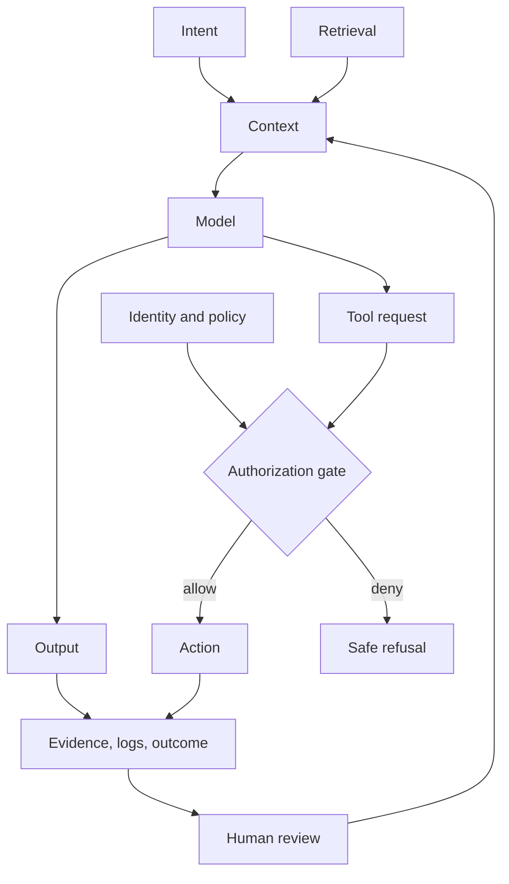

# Book Map

## Promise to the reader

By the end of this series, a reader should be able to inspect an AI product and reason about more than the prompt. They should be able to map its data, trust boundaries, tool permissions, evidence quality, failure modes, economic incentives, and human accountability.

## Volume I: The Machinery

1. [The Machine Before the Machine](chapters/01-the-machine-before-the-machine.md)  
   How centuries of logic, statistics, computation, and institutional ambition converged.
2. [What an AI System Actually Is](chapters/02-what-an-ai-system-actually-is.md)  
   Models, context windows, embeddings, retrieval, agents, memory, tools, and evaluation.
3. [AI Security](chapters/03-ai-security.md)  
   Prompt injection, tool abuse, data exfiltration, identity, supply chains, and incident response.
4. [Using AI to Defend Against AI](chapters/04-using-ai-to-defend-against-ai.md)  
   Detection, provenance, authentication, scam resistance, and human verification.

## Volume II: Institutions Under Pressure

5. [AI in Medicine](chapters/05-ai-in-medicine.md)  
   Clinical evidence, distribution shift, decision support, monitoring, and responsibility.
6. [AI in Pharmacy](chapters/06-ai-in-pharmacy.md)  
   Medication systems, reconciliation, compounding research, pharmacovigilance, and simulation.
7. [AI in Law](chapters/07-ai-in-law.md)  
   Citation integrity, evidence provenance, discovery, privilege, and human accountability.
8. [AI and the Economy](chapters/08-ai-and-the-economy.md)  
   Task substitution, complements, market power, productivity, labor transitions, and access.

## Volume III: The Builder

9. [Vibecoding](chapters/09-vibecoding.md)  
   Fast creation, hidden debt, specifications, tests, review, and responsible acceleration.
10. [Debugging](chapters/10-debugging.md)  
    Observability, reproducibility, fault isolation, evaluations, and incident learning.
11. [Building Things That Did Not Exist](chapters/11-building-things-that-did-not-exist.md)  
    Turning a neglected problem into a trustworthy product and measurable intervention.
12. [The Future and What Could Trigger It](chapters/12-the-future-and-what-could-trigger-it.md)  
    Capability triggers, infrastructure constraints, governance, scenarios, and signposts.

## Recurring system model

The dangerous gap is the distance between fluent output and authorized action. The valuable gap is the distance between a human question and inspectable evidence.

## Reader routes

- **Builder:** 2 → 3 → 9 → 10 → 11
- **Healthcare professional:** 2 → 3 → 5 → 6 → 10
- **Leader or policymaker:** 1 → 3 → 7 → 8 → 12
- **Security practitioner:** 2 → 3 → 4 → 10 → 12

See [GLOSSARY.md](GLOSSARY.md) for shared terms and [LABS.md](LABS.md) for exercises.
