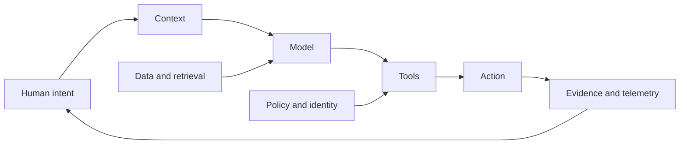

# AI: The New Operating Layer

**A technical field guide to building, securing, governing, and living with AI systems.**

Most AI writing stops at the model. This series follows the entire system: intent, context, retrieval, tools, memory, permissions, evidence, action, failure, and accountability.

[Start reading](BOOK.md) · [See manuscript status](MANUSCRIPT_STATUS.md) · [Use the labs](LABS.md) · [Review the method](RESEARCH_METHOD.md)

## The central question

When software can read private data, generate decisions, call tools, write code, and trigger real actions, “How intelligent is the model?” is no longer enough.

The harder questions are:

- What can the system reach?
- Which evidence shaped the output?
- What can manipulate it?
- Who can authorize an action?
- What remains when it fails?



## Three volumes

| Volume | Core problem | Chapters |
|---|---|---|
| **I. The Machinery** | How AI systems work and fail | history, system anatomy, AI security, defense |
| **II. Institutions Under Pressure** | How AI changes high-stakes work | medicine, pharmacy, law, economy |
| **III. The Builder** | How to create without surrendering judgment | vibecoding, debugging, new products, possible futures |

## What makes this a technical book

Every mature chapter is being developed around the same evidence contract:

1. **Hook:** a concrete failure, decision, or paradox
2. **System model:** the parts and trust boundaries
3. **Mechanism:** what happens under the interface
4. **Failure surface:** how the system breaks or is abused
5. **Build pattern:** an implementable architecture
6. **Lab:** a reproducible exercise
7. **Evidence ledger:** sources, date, confidence, and unresolved questions
8. **Field checklist:** what the reader can use immediately

## Current scope

The repository already contains twelve readable foundation chapters. They are **not being presented as a finished textbook**. The next editorial pass expands them into long-form technical chapters with primary references, worked examples, threat models, evaluation rubrics, and reproducible labs.

High-stakes material uses explicit boundaries:

- medicine and pharmacy distinguish research support from clinical authorization
- legal material distinguishes information workflows from legal advice
- finance distinguishes analysis from execution
- forecasts are labeled as forecasts
- AI-generated claims are never treated as evidence merely because they sound precise

## Build and validate

```bash
npm test
```

The validation pipeline checks chapter order, internal links, visual models, manuscript depth, and required publishing files. GitHub Actions runs it on every change and publishes the reading site through GitHub Pages.

## Read online

The repository includes a Docsify reading shell for GitHub Pages. Markdown remains the source of truth, so the same manuscript can later produce HTML, PDF, and EPUB editions.

## Contribute

Expert review is welcome across AI engineering, cybersecurity, medicine, pharmacy, law, economics, education, and technical editing. Start with [CONTRIBUTING.md](CONTRIBUTING.md) and the [research method](RESEARCH_METHOD.md).

> Build the mental model first. Then earn the right to automate the action.
